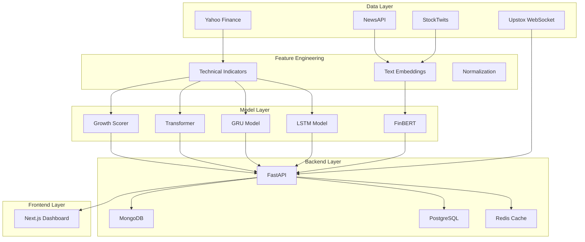

# Multi-Modal Stock Intelligence Platform


## Overview

An AI-driven stock intelligence system that integrates **time-series forecasting**, **sentiment analysis**, **growth scoring**, and **live market data streaming** to provide comprehensive stock market insights. This platform combines deep learning models (LSTM/GRU/Transformer), natural language processing (FinBERT), and real-time data pipelines to deliver actionable intelligence for stock analysis and prediction.

### Key Features

- **🤖 Multi-Modal Time-Series Forecasting**: LSTM, GRU, and Transformer models for stock price prediction
- **📰 Sentiment Analysis**: FinBERT-based sentiment analysis on news articles and social media
- **📊 Growth Scoring Engine**: Proprietary scoring system evaluating fundamental and technical indicators
- **📡 Live Market Data**: Real-time stock data streaming via Upstox WebSocket integration
- **🚀 FastAPI Backend**: High-performance async API with WebSocket support
- **💻 Next.js Dashboard**: Modern, responsive web interface for visualization and interaction
- **🔄 MLOps Pipeline**: Experiment tracking with MLflow, hyperparameter optimization with Optuna
- **📦 Containerized Deployment**: Docker-based architecture with PostgreSQL, MongoDB, and Redis

### Target Audience

This project serves as a comprehensive final-year engineering project and portfolio showcase, demonstrating expertise in machine learning, backend development, frontend engineering, and DevOps practices.

---

## Architecture



---

## Technology Stack

### Backend
- **Framework**: FastAPI (async web framework)
- **Language**: Python 3.10+
- **Real-time**: WebSockets for live data streaming
- **Caching**: Redis
- **Databases**: PostgreSQL (relational), MongoDB (document store)

### Machine Learning / AI
- **Deep Learning**: PyTorch (LSTM, GRU, Transformer)
- **NLP**: Hugging Face Transformers (FinBERT)
- **Traditional ML**: scikit-learn (growth scoring)
- **Hyperparameter Tuning**: Optuna
- **Experiment Tracking**: MLflow

### Data Sources & Processing
- **Market Data**: yfinance, Upstox API
- **News**: NewsAPI
- **Social Sentiment**: StockTwits
- **Processing**: pandas, NumPy
- **Technical Analysis**: TA-Lib, pandas-ta

### Frontend
- **Framework**: Next.js 14 (React)
- **Styling**: TailwindCSS
- **Charts**: Plotly / Recharts
- **State Management**: React Query / Zustand

### DevOps & Infrastructure
- **Containerization**: Docker, Docker Compose
- **CI/CD**: GitHub Actions
- **Data Versioning**: DVC
- **Monitoring**: Prometheus, Loguru

---

## Project Structure

```
test/
├── backend/                 # FastAPI application
│   ├── api/                # API route handlers
│   ├── services/           # Business logic services
│   ├── integrations/       # Third-party integrations (Upstox, NewsAPI)
│   ├── cache/              # Redis caching layer
│   ├── models/             # Database models (SQLAlchemy, PyMongo)
│   └── utils/              # Utility functions
├── frontend/               # Next.js dashboard
│   ├── src/               # Source code
│   │   ├── app/           # Next.js 14 app directory
│   │   ├── components/    # React components
│   │   └── lib/           # Libraries and utilities
│   └── public/            # Static assets
├── data/                   # Datasets
│   ├── raw/               # Raw data from sources
│   ├── processed/         # Processed, feature-engineered data
│   └── external/          # External reference data
├── models/                 # ML model implementations
│   ├── checkpoints/       # Saved model weights
│   └── configs/           # Model configurations
├── scripts/                # Data ingestion scripts
│   ├── fetch_historical_prices.py   # Historical OHLCV data (yfinance)
│   ├── fetch_fundamentals.py        # Company fundamentals (Yahoo Finance / Alpha Vantage)
│   ├── fetch_news.py                # News articles (NewsAPI)
│   ├── fetch_social_sentiment.py   # Social sentiment (StockTwits)
│   ├── fetch_macro_data.py         # Macroeconomic indicators (World Bank)
│   └── README.md                    # Detailed script documentation
├── notebooks/              # Jupyter notebooks for EDA
├── tests/                  # Test suite
│   ├── unit/              # Unit tests
│   └── integration/       # Integration tests
├── docker/                 # Docker configurations
├── docs/                   # Project documentation
├── logs/                   # Application logs
├── mlruns/                 # MLflow tracking artifacts
├── requirements.txt        # Python dependencies
├── Dockerfile              # Backend Docker image
├── docker-compose.yml      # Multi-container orchestration
├── pytest.ini              # pytest configuration
└── README.md               # This file
```

---

## Prerequisites

- **Python**: 3.10 or higher
- **Docker**: Latest version
- **Docker Compose**: Latest version
- **Node.js**: 18+ (for frontend development)
- **Git**: Version control
- **API Keys**: 
  - [NewsAPI](https://newsapi.org/) - News data
  - [Upstox Developer](https://upstox.com/developer/) - Live market data
  - [StockTwits](https://stocktwits.com/developers) - Social sentiment (optional)
  - [Alpha Vantage](https://www.alphavantage.co/) - Additional market data (optional)

---

## Installation & Setup

### Step 1: Clone Repository

```bash
git clone <repository-url>
cd test
```

### Step 2: Environment Configuration

```bash
# Copy environment template
cp .env.template .env

# Edit .env and add your API keys
nano .env  # or use your preferred editor
```

**Required Environment Variables:**
- `SECRET_KEY`: Generate with `openssl rand -hex 32`
- `POSTGRES_PASSWORD`: Strong password for PostgreSQL
- `MONGO_INITDB_ROOT_PASSWORD`: Strong password for MongoDB
- `NEWSAPI_KEY`: Your NewsAPI key
- `UPSTOX_API_KEY` & `UPSTOX_API_SECRET`: Upstox credentials

### Step 3: Docker Setup (Recommended)

```bash
# Start all services
docker-compose up -d

# View logs
docker-compose logs -f

# Stop all services
docker-compose down
```

**Services Running:**
- Backend API: http://localhost:8000
- Frontend Dashboard: http://localhost:3000
- MLflow UI: http://localhost:5000
- PostgreSQL: localhost:5432
- MongoDB: localhost:27017
- Redis: localhost:6379

### Step 4: Local Development Setup (Alternative)

```bash
# Create virtual environment
python -m venv venv
source venv/bin/activate  # On Windows: venv\Scripts\activate

# Install dependencies
pip install -r requirements.txt

# Ensure PostgreSQL, MongoDB, and Redis are running locally
# Then start the backend
uvicorn backend.main:app --reload
```

### Step 5: Frontend Setup

```bash
cd frontend

# Install dependencies
npm install

# Run development server
npm run dev

# Access at http://localhost:3000
```

---

## Usage

> **📌 Current Implementation Status**: The project is currently in **Phase 1: Data Pipelines**. Infrastructure setup is complete, and data ingestion scripts for historical prices, fundamentals, news, social sentiment, and macroeconomic indicators are now available. ML models and full API endpoints are planned for upcoming phases. See the [Project Roadmap](#project-roadmap) and [Data Pipeline](#data-pipeline) sections for details.

### API Documentation

Interactive API documentation is available via Swagger UI:

**Swagger UI**: http://localhost:8000/docs  
**ReDoc**: http://localhost:8000/redoc

### Dashboard

Access the Next.js dashboard at http://localhost:3000 for:
- Real-time stock price monitoring
- Price prediction visualizations
- Sentiment analysis results
- Growth score rankings
- Historical data exploration

### MLflow Tracking

Monitor experiments, compare models, and manage model registry:

**MLflow UI**: http://localhost:5000

---

## Data Pipeline

Phase 1 data ingestion scripts are now available! These scripts fetch data from various sources and store it in timestamp-partitioned directories under `data/raw/`. For detailed usage instructions, see [scripts/README.md](scripts/README.md).

### Fetch Historical Data

```bash
# Fetch historical prices for a ticker
python scripts/fetch_historical_prices.py --ticker RELIANCE.NS --start 2020-01-01 --end 2024-12-31

# Fetch with weekly interval
python scripts/fetch_historical_prices.py --ticker RELIANCE.NS --start 2020-01-01 --end 2024-12-31 --interval 1wk

# Incremental update (fetch only new data since last run)
python scripts/fetch_historical_prices.py --ticker RELIANCE.NS --incremental

# Fetch company fundamentals
python scripts/fetch_fundamentals.py --ticker RELIANCE.NS --source yahoo

# Fetch news articles (last 30 days)
python scripts/fetch_news.py --ticker RELIANCE --days 30

# Fetch social sentiment from StockTwits
python scripts/fetch_social_sentiment.py --ticker RELIANCE --limit 100

# Fetch macroeconomic indicators
python scripts/fetch_macro_data.py --country IND --preset full --start-year 2010
```

### Data Storage

All fetched data is stored in date-partitioned subdirectories:
- `data/raw/prices/YYYY-MM-DD/` - Historical OHLCV data (CSV)
- `data/raw/fundamentals/YYYY-MM-DD/` - Company fundamentals (JSON)
- `data/raw/news/YYYY-MM-DD/` - News articles (JSON)
- `data/raw/social/YYYY-MM-DD/` - Social sentiment (JSON)
- `data/raw/macro/YYYY-MM-DD/` - Macroeconomic indicators (CSV)

### Feature Engineering (Planned)

```bash
# Generate technical indicators
python scripts/generate_features.py --input data/raw/RELIANCE.csv --output data/processed/

# Create time-series sequences
python scripts/create_sequences.py --lookback 60 --horizon 7
```

---

## Model Training

> **⚠️ Note**: The following model training scripts are **planned** and not yet implemented. They will be created in Phase 2 of the development roadmap.

### Time-Series Forecasting (Planned)

```bash
# Train LSTM model
python scripts/train_forecasting_models.py --model lstm --epochs 100 --batch-size 32

# Train GRU model
python scripts/train_forecasting_models.py --model gru --epochs 100 --batch-size 32

# Train Transformer model
python scripts/train_forecasting_models.py --model transformer --epochs 50 --batch-size 16

# Hyperparameter optimization with Optuna
python scripts/optimize_hyperparams.py --model lstm --trials 100
```

### Sentiment Analysis (Planned)

```bash
# Fine-tune FinBERT on financial news
python scripts/train_sentiment_model.py --data data/processed/news_labeled.csv --epochs 5

# Evaluate sentiment model
python scripts/evaluate_sentiment.py --model models/checkpoints/finbert_sentiment
```

### Growth Scoring (Planned)

```bash
# Train growth scoring model
python scripts/train_growth_scorer.py --data data/processed/fundamentals.csv

# Generate growth scores
python scripts/generate_growth_scores.py --output data/processed/growth_scores.csv
```

---

## Testing

```bash
# Run all tests
pytest

# Run with coverage report
pytest tests/ -v --cov=backend --cov-report=html

# Run specific test categories
pytest -m unit          # Unit tests only
pytest -m integration   # Integration tests only
pytest -m slow          # Slow tests only

# View coverage report
open htmlcov/index.html
```

---

## API Endpoints

### Currently Implemented

- `GET /` - Root endpoint with API information
- `GET /health` - Backend health status check
- `GET /docs` - Interactive Swagger API documentation
- `GET /redoc` - ReDoc API documentation

### Planned Endpoints (Future Implementation)

The following endpoints are planned for future phases:

#### Forecasting (Phase 2)

- `POST /api/v1/predict/price` - Stock price forecasting
  ```json
  {
    "ticker": "RELIANCE",
    "model": "lstm",
    "horizon": 7
  }
  ```

#### Sentiment Analysis (Phase 2)

- `POST /api/v1/predict/sentiment` - News sentiment analysis
  ```json
  {
    "ticker": "RELIANCE",
    "articles": ["News article text..."]
  }
  ```

#### Growth Scoring (Phase 2)

- `GET /api/v1/growth-score?ticker=RELIANCE` - Get growth score
- `GET /api/v1/growth-score/rankings?top=50` - Top growth stocks

#### Live Data Streaming (Phase 3)

- `GET /api/v1/stream/ticks?ticker=RELIANCE` - WebSocket endpoint for live ticks

#### Historical Data (Phase 1)

- `GET /api/v1/historical/{ticker}?start=2024-01-01&end=2024-12-31` - Historical OHLCV data

---

## Evaluation Metrics

Refer to [docs/metrics_and_evaluation.md](docs/metrics_and_evaluation.md) for detailed evaluation criteria.

### Forecasting Metrics
- **MAE** (Mean Absolute Error)
- **RMSE** (Root Mean Squared Error)
- **Directional Accuracy** (percentage of correct direction predictions)
- **Sharpe Ratio** (risk-adjusted returns)

### Sentiment Analysis Metrics
- **F1 Score**
- **Precision**
- **Recall**
- **Confusion Matrix**

### Growth Scoring Metrics
- **Spearman Correlation** (with actual returns)
- **Top-K Precision** (accuracy of top-ranked stocks)

---

## Project Roadmap

### Phase 0: Infrastructure Setup ✅
- ✅ Project structure and directory hierarchy
- ✅ Docker configuration (backend, frontend, databases)
- ✅ Basic FastAPI application with health check
- ✅ Environment configuration template
- ✅ Git ignore patterns and DVC setup
- ✅ Testing framework configuration

### Phase 1: Data Pipelines 🔄 (In Progress)
- ✅ Historical price data collection scripts (yfinance)
- ✅ Company fundamentals fetching (Yahoo Finance / Alpha Vantage)
- ✅ News data aggregation (NewsAPI)
- ✅ Social sentiment collection (StockTwits)
- ✅ Macroeconomic indicators (World Bank API)
- ✅ Timestamp-based data partitioning
- ✅ Rate limiting and retry logic
- ✅ Comprehensive logging and error handling
- 📅 Feature engineering pipeline
- 📅 Data validation and quality checks

### Phase 2: Model Development 📅
- LSTM/GRU/Transformer implementation
- FinBERT fine-tuning
- Growth scoring algorithm
- Model evaluation and selection

### Phase 3: Live Integration 📅
- Upstox WebSocket integration
- Real-time inference pipeline
- Streaming data processing

### Phase 4: Backend API 📅
- FastAPI endpoint implementation
- Database setup and ORM
- Caching layer with Redis
- Authentication and authorization

### Phase 5: Frontend Dashboard 📅
- Next.js UI development
- Interactive charts and visualizations
- Real-time updates
- User experience optimization

### Phase 6: Deployment 📅
- Production Docker configuration
- CI/CD pipeline setup
- Cloud deployment (AWS/GCP/Azure)
- Monitoring and logging

---

## Contributing

We welcome contributions! Please read [CONTRIBUTING.md](CONTRIBUTING.md) for guidelines on:
- Code style and standards
- Testing requirements
- Pull request process
- Commit message conventions

---

## License

This project is licensed under the MIT License - see the [LICENSE](LICENSE) file for details.

---

## Acknowledgments

- **Data Sources**: Yahoo Finance, NewsAPI, StockTwits, Upstox
- **Libraries**: PyTorch, Hugging Face Transformers, FastAPI, Next.js
- **Research Papers**: 
  - [LSTM for Stock Price Prediction](https://arxiv.org/abs/1506.02078)
  - [FinBERT: Financial Sentiment Analysis](https://arxiv.org/abs/1908.10063)
  - [Attention Is All You Need (Transformers)](https://arxiv.org/abs/1706.03762)

---

## Contact

**Project Maintainer**: [Dheeraj Joshi]  
**Email**: [dheerajjoshicontact@gmai.com]  

---

## References

- [Project Charter](docs/charter.md) - Detailed project scope and objectives
- [Metrics & Evaluation](docs/metrics_and_evaluation.md) - Evaluation methodology and success criteria
- [API Documentation](http://localhost:8000/docs) - Interactive API reference
- [Contributing Guide](CONTRIBUTING.md) - Contribution guidelines

---

**Built with ❤️ for intelligent stock market analysis**

