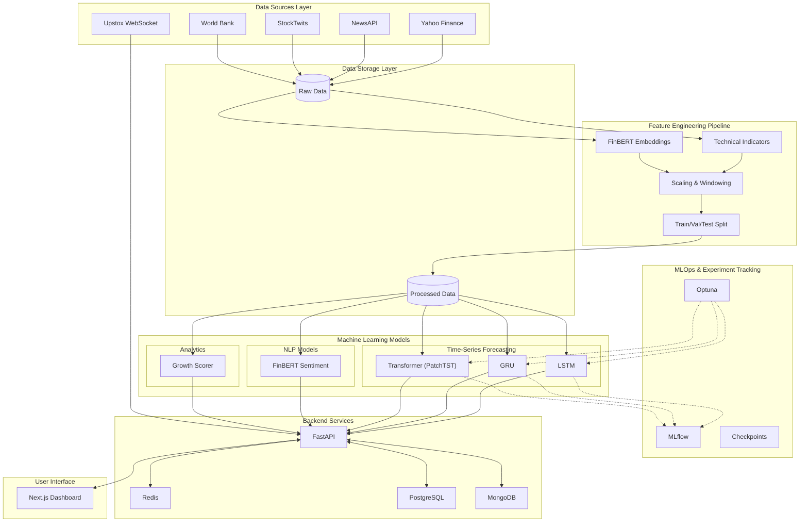

# Multi-Modal Stock Intelligence

[](https://python.org)
[](https://pytorch.org)
[](https://fastapi.tiangolo.com)
[](LICENSE)

**Advanced financial analytics platform integrating deep learning, sentiment analysis, and real-time market data.**

[Features](#key-features) • [Architecture](#architecture) • [Quick Start](#quick-start) • [Documentation](docs/)

---

## Overview

Multi-Modal Stock Intelligence is a production-ready forecasting engine that fuses quantitative market data with qualitative sentiment signals. Unlike traditional technical analysis tools, this platform leverages Transformer-based architectures (PatchTST) and FinBERT embeddings to capture both market momentum and investor sentiment.

### Key Capabilities

| Feature | Description | Tech Stack |
|---------|-------------|------------|
| **Deep Forecasting** | Multi-horizon price prediction (7-day) using LSTM, GRU, and Transformers. | PyTorch, Optuna |
| **Sentiment Engine** | Real-time news and social media sentiment analysis with FinBERT. | HuggingFace, NewsAPI |
| **Real-Time Stream** | Live market data ingestion via WebSocket for sub-second updates. | Upstox, Redis |
| **Growth Scoring** | Proprietary fundamental analysis algorithm for long-term value investing. | Scikit-learn, Pandas |
| **MLOps Pipeline** | End-to-end experiment tracking, model registry, and hyperparameter tuning. | MLflow, Docker |

---

## Architecture

The system follows a modular microservices architecture designed for scalability and maintainability.



### Architecture Highlights

- **Multi-Modal Data Integration**: Combines price data, news, social sentiment, and macroeconomic indicators.
- **Comprehensive Feature Engineering**: 60-day windowing with technical indicators and FinBERT embeddings.
- **State-of-the-Art Models**: LSTM, GRU, and Transformer (PatchTST) for time-series forecasting.
- **MLOps Pipeline**: Automated experiment tracking (MLflow) and hyperparameter optimization (Optuna).
- **High-Performance Backend**: Async FastAPI with Redis caching and dual database architecture.

---

## Technology Stack

- **Core Infrastructure**: Python 3.10+, FastAPI, Docker, Redis, PostgreSQL, MongoDB
- **Machine Learning**: PyTorch, Hugging Face Transformers, Scikit-Learn, MLflow, Optuna
- **Frontend**: Next.js, TailwindCSS, Plotly

---

## Project Structure

```bash
test/
├── backend/                 # FastAPI application
├── frontend/                # Next.js dashboard
├── data/                    # Datasets (raw, processed, external)
├── models/                  # ML model implementations (LSTM, GRU, Transformer)
├── scripts/                 # Data ingestion and training scripts
├── notebooks/               # Jupyter notebooks for EDA and evaluation
├── tests/                   # Unit and integration tests
├── docker/                  # Docker configurations
├── docs/                    # Project documentation
└── mlruns/                  # MLflow tracking artifacts
```

---

## Prerequisites

- **Python**: 3.10 or higher
- **Docker**: Latest version
- **API Keys**: NewsAPI, Upstox Developer, StockTwits (optional)

---

## Installation & Setup

### 1. Clone Repository

```bash
git clone <repository-url>
cd test
```

### 2. Environment Configuration

Copy the template and configure your API keys:

```bash
cp .env.template .env
# Edit .env with your credentials
```

### 3. Docker Setup (Recommended)

```bash
docker-compose up -d
```

Services will be available at:
- Backend API: http://localhost:8000
- Frontend Dashboard: http://localhost:5173
- MLflow UI: http://localhost:5000

#### First Time Login
1. Navigate to http://localhost:5173
2. You will see the login page (authentication is required)
3. Click **"Login with Upstox"** button
4. Approve access in the Upstox OAuth interface
5. You'll be automatically redirected to the dashboard
6. Token is persisted in localStorage for subsequent sessions

### 4. Local Development Setup

```bash
python -m venv venv
source venv/bin/activate
pip install -r requirements.txt
uvicorn backend.main:app --reload
```

---

## Authentication

### Upstox OAuth Integration

The platform uses **Upstox OAuth 2.0** for secure authentication:

- Users must log in via Upstox before accessing the dashboard
- Access tokens are automatically stored in localStorage
- Tokens persist across browser sessions
- Logout clears token and returns to login page

#### User Flow
1. **Login Page** - Professional UI appears on first visit
2. **OAuth** - User approves access in Upstox app
3. **Token Exchange** - Backend exchanges auth code for access token
4. **Dashboard** - Automatic redirect after successful authentication
5. **Token Persistence** - Subsequent visits load dashboard directly
6. **Logout** - User menu → Logout option clears authentication

#### Security Features
- Token stored securely in browser localStorage
- Cross-tab logout synchronization via storage events
- Session persistence on tab focus
- OAuth 2.0 industry-standard flow

---

## Features & Components

### Sentiment Analysis (RAG Pipeline)
- **LLM**: Gemini 3 Flash with File Search for managed RAG
- **Embeddings**: Gemini embedding-001 (768-dim vectors)
- **News Sources**: RSS feeds from Google News, Bloomberg, Reuters, etc.
- **Models**: Both Gemini API and local Ollama fallback support
- **Output**: Sentiment score (-1.0 to 1.0), confidence, risk level, key themes

### API Model Validation
- Startup model availability checks prevent 404 errors
- Validates requested models against live API
- Graceful fallback if configured models unavailable
- Logs available models for debugging

### Embedding Health Checks
- Detects zero-vector poisoning (all-zero embeddings)
- Rejects contaminated embedding batches
- Prevents silent vector store corruption
- Health metrics: contamination detection, batch statistics

---

## Usage

### Dashboard & API

- **Dashboard**: Real-time analytics and visualizations.
- **API Documentation**: Interactive Swagger UI at `/docs`.
- **MLflow**: Experiment tracking and model registry.

### Core Workflows

#### Data Ingestion

Fetch data from various sources using the scripts in `scripts/`:

```bash
# Fetch historical prices
python scripts/fetch_historical_prices.py --ticker RELIANCE.NS --start 2020-01-01 --end 2024-12-31

# Fetch news articles
python scripts/fetch_news.py --ticker RELIANCE --days 30
```

#### Feature Engineering

Transform raw data into model-ready features:

```bash
python scripts/feature_engineering.py --ticker RELIANCE.NS
python scripts/text_embeddings.py --ticker RELIANCE --source news
```

#### Model Training

Train forecasting and sentiment models:

```bash
# Train LSTM model
python scripts/train_forecasting_models.py --model-type lstm --ticker RELIANCE.NS --max-epochs 100

# Train Sentiment model
python scripts/train_sentiment_model.py --data-dir data/raw/news --price-dir data/raw/prices

# Train Growth Scorer
python scripts/train_growth_scorer.py --fundamentals-dir data/raw/fundamentals --technical-dir data/processed --price-dir data/raw/prices
```

---

## Evaluation Metrics

We target specific performance metrics as defined in our documentation:

- **Forecasting**: MAE reduction >= 15%, Directional Accuracy >= 55%, Sharpe Ratio >= 1.0
- **Sentiment**: F1 Score >= 0.80
- **Growth Scoring**: Spearman Correlation >= 0.30, Top-10 Precision >= 70%

Refer to `docs/metrics_and_evaluation.md` for detailed criteria.

---

## Testing

Run the test suite to ensure system stability:

```bash
pytest tests/
```

---

## Recent Updates (February 2026)

### Authentication & Security
- ✅ **Upstox OAuth Login Gate**: Users must authenticate before accessing dashboard
- ✅ **AuthContext**: Global authentication state management with React Context API
- ✅ **Protected Routes**: Dashboard and trading views require valid authentication
- ✅ **Token Persistence**: OAuth tokens stored in localStorage with cross-tab sync
- ✅ **Logout Functionality**: User menu with logout option and token cleanup

### RAG Pipeline Improvements
- ✅ **Gemini 3 Flash Models**: Upgraded from Gemini 2.0-Flash for 3x faster inference
- ✅ **Managed RAG with File Search**: Eliminates local vector DB complexity
- ✅ **Defensive Safeguards**: Model validation, zero-vector detection, health checks
- ✅ **google-genai SDK Migration**: Replaced deprecated google-generativeai library
- ✅ **REST API Embeddings**: Gemini embedding-001 (768-dim) via REST endpoints
- ✅ **Fallback Architecture**: Primary managed RAG with vector store fallback

### Error Handling & Resilience
- ✅ **ModelValidator**: Validates model availability at startup
- ✅ **EmbeddingHealthCheck**: Detects and prevents zero-vector poisoning
- ✅ **Pre-initialized Fallbacks**: All paths initialized before errors occur
- ✅ **Graceful Degradation**: System remains functional if primary path fails

### Frontend Enhancements
- ✅ **Professional Login UI**: Modern gradient design with animations
- ✅ **Responsive Design**: Mobile-friendly login and dashboard
- ✅ **User Menu**: Logout, settings, and profile options in navbar
- ✅ **Token Auto-Detection**: Checks localStorage on app load
- ✅ **Loading States**: Proper loading indicators during auth flow

---

## Contributing

Please read [CONTRIBUTING.md](CONTRIBUTING.md) for guidelines on code style, testing, and the pull request process.

---

## License

This project is licensed under the MIT License. See the [LICENSE](LICENSE) file for details.
