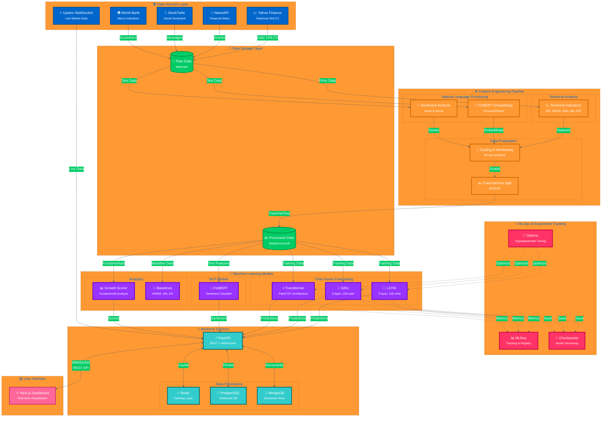

# 📈 Multi-Modal Stock Intelligence

<div align="center">

[](https://python.org)
[](https://pytorch.org)
[](https://fastapi.tiangolo.com)
[](https://nextjs.org)
[](https://docker.com)
[](LICENSE)

**Advanced financial analytics platform integrating deep learning, sentiment analysis, and real-time market data.**

[Features](#key-features) • [Architecture](#architecture) • [Quick Start](#quick-start) • [Documentation](docs/)

</div>

---

## 🚀 Overview

**Multi-Modal Stock Intelligence** is a production-ready forecasting engine that fuses quantitative market data with qualitative sentiment signals. Unlike traditional technical analysis tools, this platform leverages **Transformer-based architectures (PatchTST)** and **FinBERT** embeddings to capture both market momentum and investor sentiment.

### ✨ Key Capabilities

| Feature | Description | Tech Stack |
|---------|-------------|------------|
| **� Deep Forecasting** | Multi-horizon price prediction (7-day) using LSTM, GRU, and Transformers. | `PyTorch` `Optuna` |
| **🧠 Sentiment Engine** | Real-time news and social media sentiment analysis with FinBERT. | `HuggingFace` `NewsAPI` |
| **⚡ Real-Time Stream** | Live market data ingestion via WebSocket for sub-second updates. | `Upstox` `Redis` |
| **📊 Growth Scoring** | Proprietary fundamental analysis algorithm for long-term value investing. | `Scikit-learn` `Pandas` |
| **🔬 MLOps Pipeline** | End-to-end experiment tracking, model registry, and hyperparameter tuning. | `MLflow` `Docker` |

---

## Architecture



### Architecture Highlights

- **📊 Multi-Modal Data Integration**: Combines price data, news, social sentiment, and macroeconomic indicators
- **🔄 Comprehensive Feature Engineering**: 60-day windowing with technical indicators and FinBERT embeddings
- **🧠 State-of-the-Art Models**: LSTM, GRU, and Transformer (PatchTST) for time-series forecasting
- **🎯 MLOps Pipeline**: Automated experiment tracking (MLflow) and hyperparameter optimization (Optuna)
- **⚡ High-Performance Backend**: Async FastAPI with Redis caching and dual database architecture
- **📈 Real-Time Capabilities**: WebSocket integration for live market data streaming
- **💻 Modern Frontend**: Next.js dashboard with interactive visualizations

---

## Technology Stack

### Backend
- **Framework**: FastAPI (async web framework)
- **Language**: Python 3.10+
- **Real-time**: WebSockets for live data streaming
- **Caching**: Redis
- **Databases**: PostgreSQL (relational), MongoDB (document store)

### Machine Learning / AI
- **Deep Learning**: PyTorch (LSTM, GRU, Transformer)
- **NLP**: Hugging Face Transformers (FinBERT)
- **Traditional ML**: scikit-learn (growth scoring)
- **Hyperparameter Tuning**: Optuna
- **Experiment Tracking**: MLflow

### Data Sources & Processing
- **Market Data**: yfinance, Upstox API
- **News**: NewsAPI
- **Social Sentiment**: StockTwits
- **Processing**: pandas, NumPy
- **Technical Analysis**: TA-Lib, pandas-ta

### Frontend
- **Framework**: Next.js 14 (React)
- **Styling**: TailwindCSS
- **Charts**: Plotly / Recharts
- **State Management**: React Query / Zustand

### DevOps & Infrastructure
- **Containerization**: Docker, Docker Compose
- **CI/CD**: GitHub Actions
- **Data Versioning**: DVC
- **Monitoring**: Prometheus, Loguru

---

## Project Structure

```
test/
├── backend/                 # FastAPI application
│   ├── api/                # API route handlers
│   ├── services/           # Business logic services
│   ├── integrations/       # Third-party integrations (Upstox, NewsAPI)
│   ├── cache/              # Redis caching layer
│   ├── models/             # Database models (SQLAlchemy, PyMongo)
│   └── utils/              # Utility functions
├── frontend/               # Next.js dashboard
│   ├── src/               # Source code
│   │   ├── app/           # Next.js 14 app directory
│   │   ├── components/    # React components
│   │   └── lib/           # Libraries and utilities
│   └── public/            # Static assets
├── data/                   # Datasets
│   ├── raw/               # Raw data from sources
│   ├── processed/         # Processed, feature-engineered data
│   └── external/          # External reference data
├── models/                 # ML model implementations
│   ├── base_forecaster.py # Abstract base class for forecasting models
│   ├── lstm_forecaster.py # LSTM model implementation
│   ├── gru_forecaster.py  # GRU model implementation
│   ├── transformer_forecaster.py # Transformer (PatchTST) implementation
│   ├── model_config.py    # Model configuration dataclasses
│   ├── checkpoints/       # Saved model weights (.pth files)
│   └── configs/           # Model configurations (JSON)
├── scripts/                # Data ingestion scripts
│   ├── fetch_historical_prices.py   # Historical OHLCV data (yfinance)
│   ├── fetch_fundamentals.py        # Company fundamentals (Yahoo Finance / Alpha Vantage)
│   ├── fetch_news.py                # News articles (NewsAPI)
│   ├── fetch_social_sentiment.py   # Social sentiment (StockTwits)
│   ├── fetch_macro_data.py         # Macroeconomic indicators (World Bank)
│   └── README.md                    # Detailed script documentation
├── notebooks/              # Jupyter notebooks for EDA
├── tests/                  # Test suite
│   ├── unit/              # Unit tests
│   └── integration/       # Integration tests
├── docker/                 # Docker configurations
├── docs/                   # Project documentation
├── logs/                   # Application logs
├── mlruns/                 # MLflow tracking artifacts
├── requirements.txt        # Python dependencies
├── Dockerfile              # Backend Docker image
├── docker-compose.yml      # Multi-container orchestration
├── pytest.ini              # pytest configuration
└── README.md               # This file
```

---

## Prerequisites

- **Python**: 3.10 or higher
- **Docker**: Latest version
- **Docker Compose**: Latest version
- **Node.js**: 18+ (for frontend development)
- **Git**: Version control
- **API Keys**: 
  - [NewsAPI](https://newsapi.org/) - News data
  - [Upstox Developer](https://upstox.com/developer/) - Live market data
  - [StockTwits](https://stocktwits.com/developers) - Social sentiment (optional)
  - [Alpha Vantage](https://www.alphavantage.co/) - Additional market data (optional)

---

## Installation & Setup

### Step 1: Clone Repository

```bash
git clone <repository-url>
cd test
```

### Step 2: Environment Configuration

```bash
# Copy environment template
cp .env.template .env

# Edit .env and add your API keys
nano .env  # or use your preferred editor
```

**Required Environment Variables:**
- `SECRET_KEY`: Generate with `openssl rand -hex 32`
- `POSTGRES_PASSWORD`: Strong password for PostgreSQL
- `MONGO_INITDB_ROOT_PASSWORD`: Strong password for MongoDB
- `NEWSAPI_KEY`: Your NewsAPI key
- `UPSTOX_API_KEY` & `UPSTOX_API_SECRET`: Upstox credentials

### Step 3: Docker Setup (Recommended)

```bash
# Start all services
docker-compose up -d

# View logs
docker-compose logs -f

# Stop all services
docker-compose down
```

**Services Running:**
- Backend API: http://localhost:8000
- Frontend Dashboard: http://localhost:3000
- MLflow UI: http://localhost:5000
- PostgreSQL: localhost:5432
- MongoDB: localhost:27017
- Redis: localhost:6379

### Step 4: Local Development Setup (Alternative)

```bash
# Create virtual environment
python -m venv venv
source venv/bin/activate  # On Windows: venv\Scripts\activate

# Install dependencies
pip install -r requirements.txt

# Ensure PostgreSQL, MongoDB, and Redis are running locally
# Then start the backend
uvicorn backend.main:app --reload
```

### Step 5: Frontend Setup

```bash
cd frontend

# Install dependencies
npm install

# Run development server
npm run dev

# Access at http://localhost:3000
```

---

## Usage

> **📌 Current Implementation Status**: The project is now in **Phase 3: Time-Series Forecasting Models**. Phase 1 ingestion pipelines and Phase 2 feature engineering are complete. LSTM, GRU, and Transformer models have been implemented with MLflow experiment tracking and Optuna hyperparameter tuning. See the [Model Training](#model-training) section for quick-start examples or review the comprehensive [evaluation notebook](notebooks/forecasting_evaluation.ipynb).

### API Documentation

Interactive API documentation is available via Swagger UI:

**Swagger UI**: http://localhost:8000/docs  
**ReDoc**: http://localhost:8000/redoc

### Dashboard

Access the Next.js dashboard at http://localhost:3000 for:
- Real-time stock price monitoring
- Price prediction visualizations
- Sentiment analysis results
- Growth score rankings
- Historical data exploration

### MLflow Tracking

Monitor experiments, compare models, and manage model registry:

**MLflow UI**: http://localhost:5000

```bash
# View MLflow experiments locally
mlflow ui --backend-store-uri ./mlruns
```

Track experiments for:
- Model training runs (hyperparameters, metrics, model artifacts)
- Hyperparameter tuning trials (Optuna integration)
- Model comparison and selection
- Checkpoint versioning and metadata

---

## Data Pipeline

Phase 1 data ingestion scripts are now available! These scripts fetch data from various sources and store it in timestamp-partitioned directories under `data/raw/`. For detailed usage instructions, see [scripts/README.md](scripts/README.md).

### Fetch Historical Data

```bash
# Fetch historical prices for a ticker
python scripts/fetch_historical_prices.py --ticker RELIANCE.NS --start 2020-01-01 --end 2024-12-31

# Fetch with weekly interval
python scripts/fetch_historical_prices.py --ticker RELIANCE.NS --start 2020-01-01 --end 2024-12-31 --interval 1wk

# Incremental update (fetch only new data since last run)
python scripts/fetch_historical_prices.py --ticker RELIANCE.NS --incremental

# Fetch company fundamentals
python scripts/fetch_fundamentals.py --ticker RELIANCE.NS --source yahoo

# Fetch news articles (last 30 days)
python scripts/fetch_news.py --ticker RELIANCE --days 30

# Fetch social sentiment from StockTwits
python scripts/fetch_social_sentiment.py --ticker RELIANCE --limit 100

# Fetch macroeconomic indicators
python scripts/fetch_macro_data.py --country IND --preset full --start-year 2010
```

### Data Storage

All fetched data is stored in date-partitioned subdirectories:
- `data/raw/prices/YYYY-MM-DD/` - Historical OHLCV data (CSV)
- `data/raw/fundamentals/YYYY-MM-DD/` - Company fundamentals (JSON)
- `data/raw/news/YYYY-MM-DD/` - News articles (JSON)
- `data/raw/social/YYYY-MM-DD/` - Social sentiment (JSON)
- `data/raw/macro/YYYY-MM-DD/` - Macroeconomic indicators (CSV)

## Feature Engineering

Phase 2 adds standalone scripts that transform raw partitions into model-ready tensors and embeddings while enforcing the leakage rules from `docs/metrics_and_evaluation.md`.

### Technical Indicators & Windowed Sequences

```bash
# Default run (RSI, MACD, EMA, BB, ATR + 60-day window)
python scripts/feature_engineering.py --ticker RELIANCE.NS

# Custom configuration
python scripts/feature_engineering.py \
  --ticker RELIANCE.NS \
  --lookback-window 90 \
  --train-split 0.7 --val-split 0.15 \
  --scaler-type standard \
  --indicators RSI,MACD,EMA

# Batch mode from CSV
python scripts/feature_engineering.py --batch-mode --ticker-file tickers.csv
```

Outputs: `train/val/test_features.npy`, `train/val/test_targets.npy`, `metadata.json`, `scaler_metadata.json`.

### FinBERT Text Embeddings

```bash
# News embeddings with default ProsusAI/finbert checkpoint
python scripts/text_embeddings.py --ticker RELIANCE --source news

# Social sentiment embeddings with sentiment labels
python scripts/text_embeddings.py --ticker RELIANCE --source social --classify-sentiment

# Larger GPU batch + alternate model
python scripts/text_embeddings.py \
  --ticker RELIANCE \
  --source news \
  --batch-size 32 \
  --device cuda \
  --model-name yiyanghkust/finbert-tone
```

Outputs: `embeddings_news.npy`, `embeddings_social.npy`, and their metadata files (article IDs, aligned trading days, text snippets, model/batch info).

### Processed Data Layout

- Stored under `data/processed/{ticker}/YYYY-MM-DD/` (same date-partition scheme as raw data)
- Includes feature tensors, targets, scaler metadata, and embedding artifacts
- Safe to regenerate from raw data; `.gitignore` excludes the binary outputs but keeps `.gitkeep`

### Leakage Prevention Highlights

- Temporal 60/20/20 splits (train oldest, test newest) enforced programmatically
- Scalers fit only on training rows and serialized for auditability
- Window generation runs within each split so no sample leaks future context
- Weekend/holiday news aligned to the next trading day before joining with price features

---

---

## Model Training

Phase 3 introduces production-ready time-series forecasting models with comprehensive training infrastructure.

### Quick Start

```bash
# Train LSTM model
python scripts/train_forecasting_models.py --model-type lstm --ticker RELIANCE.NS --max-epochs 100

# Train GRU model
python scripts/train_forecasting_models.py --model-type gru --ticker RELIANCE.NS --max-epochs 50

# Train Transformer model with hyperparameter tuning
python scripts/train_forecasting_models.py --model-type transformer --ticker RELIANCE.NS --tune --num-trials 50

# Evaluate models
jupyter notebook notebooks/forecasting_evaluation.ipynb
```

### Forecasting Models

Three model architectures for multi-step (7-day) stock price forecasting:

#### LSTM Forecaster
- **Architecture**: 2-layer LSTM with 128 hidden units per layer
- **Dropout**: 0.2 for regularization
- **Parameters**: ~100k-150k (input_dim dependent)
- **Best for**: Capturing long-term dependencies in sequential data
- **Config**: `models/configs/lstm_default.json`

#### GRU Forecaster
- **Architecture**: 2-layer GRU with 128 hidden units per layer
- **Dropout**: 0.2 for regularization
- **Parameters**: ~75k-120k (fewer than LSTM, faster training)
- **Best for**: Comparable performance to LSTM with reduced complexity
- **Config**: `models/configs/gru_default.json`

#### Transformer Forecaster (PatchTST)
- **Architecture**: Patch-based Transformer with multi-head self-attention
- **Parameters**: d_model=128, nhead=4, num_layers=2, patch_len=12
- **Best for**: Capturing long-range dependencies beyond RNN limitations
- **Config**: `models/configs/transformer_default.json`

All models reference `models/base_forecaster.py` for consistent API (checkpointing, parameter counting, inference).

### Training Features

- **MLflow Tracking**: Automatic logging of hyperparameters, metrics (train_loss, val_loss, val_mae), and model artifacts
- **Optuna Tuning**: Bayesian optimization over hidden_dim (64-256), num_layers (1-3), dropout (0.1-0.5), learning_rate (1e-4 to 1e-2)
- **Early Stopping**: Patience of 10 epochs on validation loss
- **Learning Rate Scheduling**: ReduceLROnPlateau with factor=0.5, patience=5
- **Gradient Clipping**: max_norm=1.0 to prevent exploding gradients
- **Reproducibility**: Seeded random number generators for PyTorch, NumPy, Python

### Evaluation Metrics

Per `docs/metrics_and_evaluation.md` Section 1.1 targets:
- **MAE reduction**: ≥15% vs ARIMA baseline
- **Directional Accuracy**: ≥55% (1-day), ≥53% (3-day), ≥52% (7-day)
- **RMSE reduction**: ≥12%
- **Sharpe ratio**: ≥1.0 (trading simulation)
- **Inference latency**: ≤300ms p95

Evaluate using `notebooks/forecasting_evaluation.ipynb` which includes:
- Metrics computation (MAE, RMSE, MAPE, DA)
- Baseline comparisons (ARIMA, Moving Average, Exponential Smoothing)
- Statistical significance tests (paired t-test, binomial test)
- Visualizations (predictions vs actuals, error distributions)
- Trading backtests (Sharpe, Maximum Drawdown, cumulative returns)

For detailed usage, see [scripts/README.md](scripts/README.md#phase-3-model-training).

### Sentiment Analysis (Planned)

```bash
# Fine-tune FinBERT on financial news
python scripts/train_sentiment_model.py --data data/processed/news_labeled.csv --epochs 5

# Evaluate sentiment model
python scripts/evaluate_sentiment.py --model models/checkpoints/finbert_sentiment
```

### Growth Scoring (Planned)

```bash
# Train growth scoring model
python scripts/train_growth_scorer.py --data data/processed/fundamentals.csv

# Generate growth scores
python scripts/generate_growth_scores.py --output data/processed/growth_scores.csv
```

---

## Testing

```bash
# Run all tests
pytest

# Run with coverage report
pytest tests/ -v --cov=backend --cov-report=html

# Run specific test categories
pytest -m unit          # Unit tests only
pytest -m integration   # Integration tests only
pytest -m slow          # Slow tests only

# Run Phase 3 model tests
pytest tests/unit/test_metrics.py -v
pytest tests/unit/test_models.py -v
pytest tests/unit/test_dataset.py -v

# View coverage report
open htmlcov/index.html
```

### Phase 3 Test Coverage

- `tests/unit/test_metrics.py`: Evaluation metrics (MAE, RMSE, MAPE, Directional Accuracy, Sharpe, MDD)
- `tests/unit/test_models.py`: Model architectures (LSTM, GRU, Transformer), checkpointing, config validation
- `tests/unit/test_dataset.py`: Dataset loading, validation, DataLoader creation, leakage prevention

---

## API Endpoints

### Currently Implemented

- `GET /` - Root endpoint with API information
- `GET /health` - Backend health status check
- `GET /docs` - Interactive Swagger API documentation
- `GET /redoc` - ReDoc API documentation

### Planned Endpoints (Future Implementation)

The following endpoints are planned for future phases:

#### Forecasting (Phase 2)

- `POST /api/v1/predict/price` - Stock price forecasting
  ```json
  {
    "ticker": "RELIANCE",
    "model": "lstm",
    "horizon": 7
  }
  ```

#### Sentiment Analysis (Phase 2)

- `POST /api/v1/predict/sentiment` - News sentiment analysis
  ```json
  {
    "ticker": "RELIANCE",
    "articles": ["News article text..."]
  }
  ```

#### Growth Scoring (Phase 2)

- `GET /api/v1/growth-score?ticker=RELIANCE` - Get growth score
- `GET /api/v1/growth-score/rankings?top=50` - Top growth stocks

#### Live Data Streaming (Phase 3)

- `GET /api/v1/stream/ticks?ticker=RELIANCE` - WebSocket endpoint for live ticks

#### Historical Data (Phase 1)

- `GET /api/v1/historical/{ticker}?start=2024-01-01&end=2024-12-31` - Historical OHLCV data

---

## Evaluation Metrics

Refer to [docs/metrics_and_evaluation.md](docs/metrics_and_evaluation.md) for detailed evaluation criteria.

### Forecasting Metrics
- **MAE** (Mean Absolute Error)
- **RMSE** (Root Mean Squared Error)
- **Directional Accuracy** (percentage of correct direction predictions)
- **Sharpe Ratio** (risk-adjusted returns)

### Sentiment Analysis Metrics
- **F1 Score**
- **Precision**
- **Recall**
- **Confusion Matrix**

### Growth Scoring Metrics
- **Spearman Correlation** (with actual returns)
- **Top-K Precision** (accuracy of top-ranked stocks)

---

## Project Roadmap

### Phase 0: Infrastructure Setup ✅
- ✅ Project structure and directory hierarchy
- ✅ Docker configuration (backend, frontend, databases)
- ✅ Basic FastAPI application with health check
- ✅ Environment configuration template
- ✅ Git ignore patterns and DVC setup
- ✅ Testing framework configuration

### Phase 1: Data Pipelines 🔄 (In Progress)
- ✅ Historical price data collection scripts (yfinance)
- ✅ Company fundamentals fetching (Yahoo Finance / Alpha Vantage)
- ✅ News data aggregation (NewsAPI)
- ✅ Social sentiment collection (StockTwits)
- ✅ Macroeconomic indicators (World Bank API)
- ✅ Timestamp-based data partitioning
- ✅ Rate limiting and retry logic
- ✅ Comprehensive logging and error handling
- 📅 Feature engineering pipeline
- 📅 Data validation and quality checks

### Phase 2: Feature Engineering ✅
- ✅ Technical indicators (RSI, MACD, EMA, BB, ATR via pandas-ta)
- ✅ Temporal train/val/test splits (60/20/20, chronological ordering)
- ✅ Windowed sequence generation (60-day lookback)
- ✅ Scaler fitting and persistence (MinMaxScaler/StandardScaler)
- ✅ FinBERT text embeddings (news and social sentiment)
- ✅ Data leakage prevention per docs Section 4.3/4.4

### Phase 3: Time-Series Forecasting Models ✅
- ✅ LSTM Forecaster (2-layer, 128 hidden units)
- ✅ GRU Forecaster (2-layer, 128 hidden units)
- ✅ Transformer Forecaster (PatchTST architecture)
- ✅ Unified training script with MLflow tracking
- ✅ Optuna hyperparameter tuning (50 trials, Bayesian optimization)
- ✅ Model checkpointing with metadata
- ✅ Evaluation metrics (MAE, RMSE, Directional Accuracy, Sharpe)
- ✅ Baseline models (ARIMA, Moving Average, Exponential Smoothing)
- ✅ Comprehensive evaluation notebook
- ✅ Unit tests for models, metrics, dataset

### Phase 4: FinBERT Sentiment Analysis 📅
- FinBERT fine-tuning on financial news
- Sentiment classification pipeline
- Multi-modal feature fusion
- Growth scoring algorithm
- Model evaluation and selection

### Phase 3: Live Integration 📅
- Upstox WebSocket integration
- Real-time inference pipeline
- Streaming data processing

### Phase 4: Backend API 📅
- FastAPI endpoint implementation
- Database setup and ORM
- Caching layer with Redis
- Authentication and authorization

### Phase 5: Frontend Dashboard 📅
- Next.js UI development
- Interactive charts and visualizations
- Real-time updates
- User experience optimization

### Phase 6: Deployment 📅
- Production Docker configuration
- CI/CD pipeline setup
- Cloud deployment (AWS/GCP/Azure)
- Monitoring and logging

---

## Contributing

We welcome contributions! Please read [CONTRIBUTING.md](CONTRIBUTING.md) for guidelines on:
- Code style and standards
- Testing requirements
- Pull request process
- Commit message conventions

---

## License

This project is licensed under the MIT License - see the [LICENSE](LICENSE) file for details.

---

## Acknowledgments

- **Data Sources**: Yahoo Finance, NewsAPI, StockTwits, Upstox
- **Libraries**: PyTorch, Hugging Face Transformers, FastAPI, Next.js
- **Research Papers**: 
  - [LSTM for Stock Price Prediction](https://arxiv.org/abs/1506.02078)
  - [FinBERT: Financial Sentiment Analysis](https://arxiv.org/abs/1908.10063)
  - [Attention Is All You Need (Transformers)](https://arxiv.org/abs/1706.03762)

---

## Contact

**Project Maintainer**: [Dheeraj Joshi]  
**Email**: [dheerajjoshicontact@gmai.com]  

---

## References

- [Project Charter](docs/charter.md) - Detailed project scope and objectives
- [Metrics & Evaluation](docs/metrics_and_evaluation.md) - Evaluation methodology and success criteria
- [API Documentation](http://localhost:8000/docs) - Interactive API reference
- [Contributing Guide](CONTRIBUTING.md) - Contribution guidelines

---

**Built with ❤️ for intelligent stock market analysis**

